<div align="center">



[English](README.md) · [Русский](README.ru.md) · **Español** · [Português (BR)](README.pt-br.md) · [Türkçe](README.tr.md) · [中文](README.zh.md) · [日本語](README.ja.md)

[](LICENSE)
[](#el-stack)
[](#)
[](https://github.com/mccarthy606/claude-operator-stack/commits/main)
[](https://github.com/mccarthy606)

**7 productos en 4 meses · solo · pre-revenue**

> Empecé a escribir código en enero de 2026 con Cursor y Claude. Cuatro meses después: 3 sitios en vivo, 4 codebases SaaS listos para deployar, 1 canal de YouTube activo. Este repo es el stack y el playbook con los que trabajo.

</div>

---

## Contenido

- [Qué es esto](#qué-es-esto)
- [El Stack](#el-stack)
- [7 productos en 4 meses](#7-productos-en-4-meses)
- [Quick Start](#quick-start)
- [Qué hay adentro](#qué-hay-adentro)
- [El Playbook del Operador](#el-playbook-del-operador)
- [Por qué existe](#por-qué-existe)
- [Cómo se compara](#cómo-se-compara)
- [Docs largas](#docs-largas)
- [Agradecimientos](#agradecimientos)
- [Estado](#estado)
- [Licencia](#licencia)

---

## Qué es esto

Un toolkit curado y un playbook para fundadores solo que llevan varios productos AI al mismo tiempo.

El stack es lo que instalo y actualizo. El playbook es cómo lo uso a lo largo de la semana: a qué componente recurrir y en qué orden, qué leer primero, dónde están las costuras.

La mayoría del stack es trabajo de otra gente, atribuido donde se usa. Lo que se agrega acá: la ruta de instalación, los workflows que componen las partes, y cuatro case studies de productos construidos encima.

Apunta a quienes llevan 2+ productos en simultáneo, fundadores sin background CS, y a cualquiera que quiera que Claude Code haga trabajo real en lugar de ser un chat companion.

---

## El Stack

**Núcleo (instalar siempre):**

| Capa | Componente | Autor | Qué hace por mí |
|------|-----------|-------|-----------------|
| **Orquestación** | [Claude Code](https://www.anthropic.com/claude-code) | Anthropic | El runtime |
| **Second Brain** | [Obsidian](https://obsidian.md) | Obsidian | Vault `~/Brain` como contexto de proyectos e identidad |
| **Grafo de conocimiento** | graphify | local | Carpeta de archivos → grafo navegable con detección de comunidades |
| **Generación de UI** | [Frontend-Design](https://github.com/anthropics/claude-plugins-official) | Anthropic | UI distintiva, no template |

**Opcional (instalar según use case):**

| Capa | Componente | Autor | Cuándo agregar |
|------|-----------|-------|----------------|
| **Skills + Agents** | [Everything Claude Code](https://github.com/affaan-m/everything-claude-code) | [@affaan-m](https://github.com/affaan-m) | Si querés un catálogo amplio de skills + agents (182 skills, 48 agents) |
| **SEO + Ads** | [Toprank](https://github.com/nowork-studio/toprank) | nowork-studio | Si hacés auditorías SEO o corrés Google/Meta Ads |

Cada skill y agent en este stack acredita a su autor original. Si una pieza viene de otro lado, ahí lleva el link.

Ver [stack/](stack/) para notas de setup componente por componente.

---

## 7 productos en 4 meses

Lo que este stack realmente lanzó entre enero y mayo de 2026.

| # | Producto | Estado | Stack |
|---|---------|--------|------|
| 1 | Niche Booking Trio — 3 sitios de booking nicho | **Live** (3 dominios) | Next.js · Supabase · GA4 · Sentry |
| 2 | P2P Marketplace — alquiler P2P de autos clásicos | Código completo | Next.js · Stripe Connect · Prisma |
| 3 | WhatsApp B2B SaaS — para concesionarias | Código completo | FastAPI · Docker · WhatsApp Cloud API |
| 4 | AI Legal Tool — apelación de multas con AI | Código completo | Next.js · Prisma · Claude API |
| 5 | Pipeline de producción de YouTube | **Live** (activo) | Python · yt-dlp · Whisper · Claude |
| 6 | Jarvis Workspace — asistente AI personal | **Live** (uso diario) | Claude Code · Obsidian · graphify |
| 7 | Automatización ops interna | **Live** | hooks + skills + cron |

Ver [case-studies/](case-studies/) para el *cómo*.

---

## Quick Start

Levanta el stack en una máquina nueva. macOS y Linux soportados; Windows vía WSL.

> Elegí un solo camino de install. No corras `curl | bash` encima de un clone manual: entran en conflicto.

### Vía bash (recomendado — clonar, auditar, correr)

```bash
git clone https://github.com/mccarthy606/claude-operator-stack.git
cd claude-operator-stack
less install.sh           # auditalo primero
./install.sh --dry-run    # ver qué va a hacer
./install.sh              # aplicar
```

El instalador va a:

1. Verificar que `claude` CLI esté instalado (si no, sale con instrucciones)
2. Imprimir los comandos de marketplace + plugins que tenés que correr dentro de Claude Code
3. Copiar los templates sanitizados de `settings.json` y `mcp-servers.json` a `~/.claude/` como **archivos sidecar** — tu config existente nunca se sobrescribe en silencio
4. Imprimir el checklist de próximos pasos para sumar tus API keys

Nada se commitea a tu `~/.claude/` sin confirmación explícita. El instalador soporta los flags `--dry-run` y `--yes`.

### Vía npm (camino node-native)

> **Disponible después de que el paquete se publique en Phase 9.** El registry npm devuelve 404 hasta el flip de visibilidad pública. Usá el camino bash de arriba mientras tanto.

```bash
npx claude-operator-stack init --dry-run    # preview
npx claude-operator-stack init              # aplicar
npx claude-operator-stack verify            # auditar tu setup existente
npx claude-operator-stack list-stack        # mostrar los componentes wired
```

Mismo resultado que `install.sh`, distinta ergonomía. El wizard te lleva por la selección de marketplaces, copia los configs sanitizados como sidecars (`*.from-operator-stack`) e imprime los comandos `/plugin` que vas a correr dentro de Claude Code.

---

## Qué hay adentro

El repo es un toolkit de cuatro capas: un `stack/` de componentes curados, un set de `workflows/` que los componen, artefactos (`cookbook/`, `case-studies/`, `scaffolds/`, `profiles/`, `skills/`) y la maquinaria de soporte (`configs/`, `commands/`, `docs/`, `tests/`, `credits/`). Nivel superior:

```
claude-operator-stack/
├── stack/                       ← desglose de 4 núcleo + 2 opcionales
├── workflows/                   ← 5 playbooks de operador
├── case-studies/                ← 4 productos lanzados anonimizados
├── cookbook/                    ← 12 recetas para copiar
├── skills/                      ← 6 paquetes SKILL.md propios
├── commands/                    ← 6 slash-commands sobre los skills
├── scaffolds/                   ← web-saas + whatsapp-saas
├── profiles/                    ← 4 caminos de instalación por arquetipo
├── packages/cli/                ← CLI npm hermano de install.sh
├── configs/                     ← settings/hooks/rules sanitizados
├── docs/                        ← guías largas y secciones extraídas
├── tests/                       ← suite de integración E2E
└── credits/                     ← atribución a cada autor original
```

[Árbol anotado completo →](docs/whats-inside.md)

---

## El Playbook del Operador

Cinco workflows que manejan mi semana.

### 1. Lanzar un producto en un día
De idea a URL en vivo en una sola sesión. Ver [workflows/ship-a-product-in-a-day.md](workflows/ship-a-product-in-a-day.md).

### 2. Proyectos paralelos
Mantener siete proyectos en vuelo sin perder contexto entre ellos. Ver [workflows/parallel-projects.md](workflows/parallel-projects.md).

### 3. Obsidian como contexto
Cada proyecto también tiene una nota en `~/Brain`; Claude Code la lee al inicio de la sesión. Ver [workflows/obsidian-as-context.md](workflows/obsidian-as-context.md).

### 4. Pipeline de contenido
YouTube, Instagram y drive2 en tres marcas, con la mayoría de los pasos de producción automatizados. Ver [workflows/content-pipeline.md](workflows/content-pipeline.md).

### 5. Solo ops
Soporte al cliente, billing, scheduling e infra resueltos desde el calendario de una sola persona. Ver [workflows/solo-ops.md](workflows/solo-ops.md).

---

## Por qué existe

La mayoría del material sobre AI tooling está escrito para ingenieros. Esto está escrito para operadores.

La apuesta: un no-ingeniero con una lista compacta de proyectos, un stack curado y un workflow que compone, puede lanzar más que un equipo chico, dado el setup correcto. No discuto si AI reemplaza ingenieros; documento qué puede hacer un operador con las herramientas correctas cargadas.

La mayoría de los componentes acá son trabajo de otra gente. Lo mío es el pegamento: la ruta de instalación, los workflows y los case studies que juntan siete proyectos separados en un solo stack.

---

<!-- canonical: README.md § How this compares — keep in sync -->

## Cómo se compara

Solo Stack es la envoltura operator-first sobre Claude Code; Everything Claude Code (ECC) es el catálogo upstream de skills + agents del que depende este repo; las plantillas starter son scaffolds framework-first. Solo Stack y ECC están pensados para coexistir — buena parte va a instalar los dos.

[Comparación completa →](docs/comparing-stacks.md)

---

## Docs largas

Artefactos de profundidad que no encajan en el rol del README como primera impresión: la tabla de comparación completa, el árbol anotado, un changelog narrativo y la justificación del alcance single-harness.

Ver [docs/README.md](docs/README.md) — índice de docs largas (en inglés; traducción diferida).

---

## Agradecimientos

Construido con:

- [@affaan-m](https://github.com/affaan-m) — Everything Claude Code (skills y agents)
- nowork-studio — Toprank (SEO, Google Ads, Meta Ads)
- Anthropic — Claude Code, Frontend-Design, la API
- Equipo de Obsidian — el runtime del second-brain
- Cada autor individual de skill acreditado en el frontmatter `origin:` y en [credits/README.md](credits/README.md)

Si tu trabajo está acá y no está acreditado, abrí un issue y lo arreglo el mismo día.

---

## Estado

Repo joven. v0.2 sumó el banner hero, los diagramas Mermaid, la nav en 7 idiomas y traducciones completas a RU y ES. Los case studies se llenan a medida que los productos se shippean. El CHANGELOG lleva el resto.

Issues, PRs y forks bienvenidos. El stack está pensado para customizarse: copiá lo que sirve, descartá lo que no.

---

## Licencia

MIT. Ver [LICENSE](LICENSE).

Los componentes de los que depende este stack tienen sus propias licencias — ver el repo de cada componente y [credits/README.md](credits/README.md).
