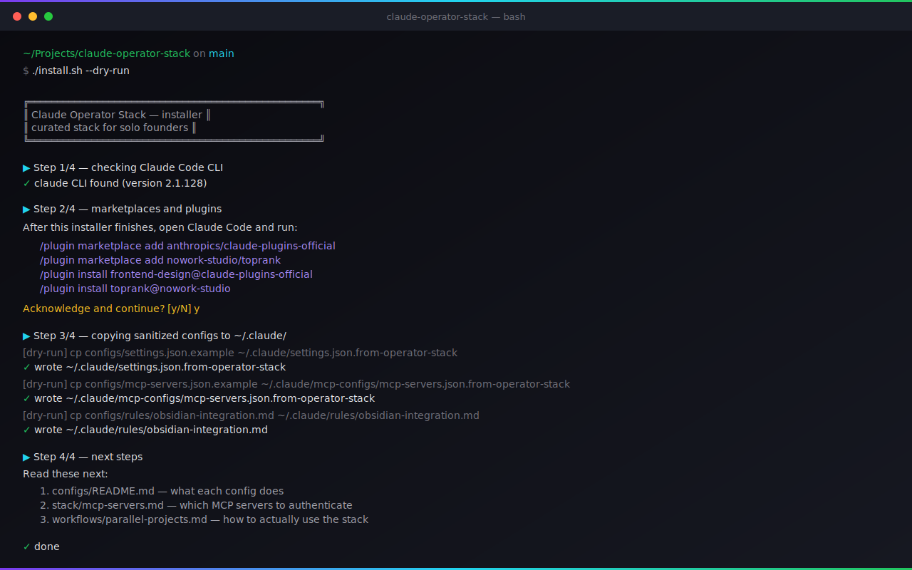
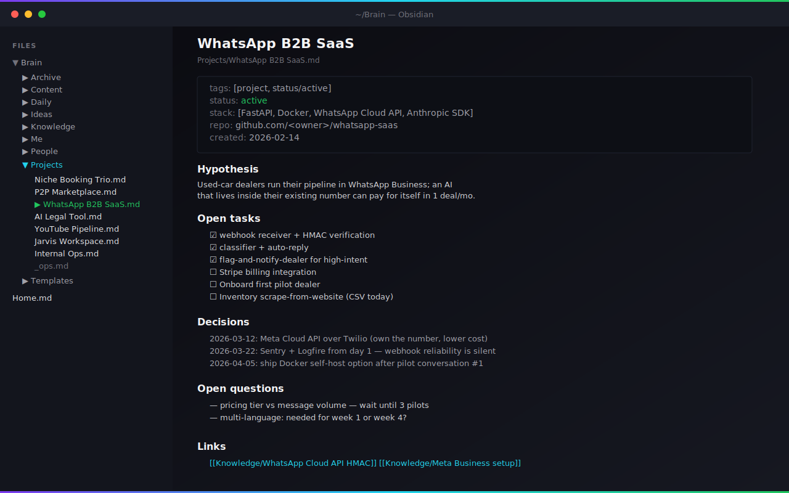
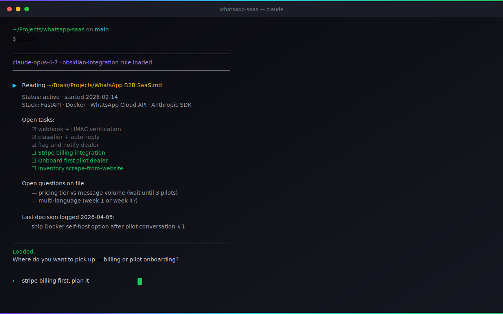

<div align="center">


**English** · [Русский](README.ru.md) · [Español](README.es.md) · [Português (BR)](README.pt-br.md) · [Türkçe](README.tr.md) · [中文](README.zh.md) · [日本語](README.ja.md)

[](LICENSE)
[](#the-stack)
[](#)
[](https://github.com/mccarthy606/claude-operator-stack/commits/main)
[](https://github.com/mccarthy606)

**7 products in 4 months · solo · pre-revenue**

> I started writing code in January 2026 with Cursor and Claude. Four months later: 3 live sites, 4 SaaS codebases ready to deploy, 1 active YouTube channel. This repo is the stack and the playbook I run from.

</div>

---

## Contents

- [What this is](#what-this-is)
- [The Stack](#the-stack)
- [The 7 products in 4 months](#the-7-products-in-4-months)
- [Quick Start](#quick-start)
- [What's Inside](#whats-inside)
- [The Operator Playbook](#the-operator-playbook)
- [Cookbook](#cookbook)
- [Solo-founder skills (originals)](#solo-founder-skills-originals)
- [Scaffolds](#scaffolds)
- [Profiles](#profiles)
- [Why this exists](#why-this-exists)
- [How this compares](#how-this-compares)
- [Acknowledgements](#acknowledgements)
- [Status](#status)
- [License](#license)

---

## What this is

A curated toolkit and a playbook for solo founders running several AI products at once.

The stack is what I install and update. The playbook is how I use it across the week — which components to reach for in which order, what to read first, where the seams are.

Most parts of the stack are other people's work, credited where used. What's added here: the install path, the workflows that compose the parts together, and four case studies of products built on top.

It's aimed at people running 2+ products at the same time, founders without a CS background, and anyone who wants Claude Code to do real work instead of being a chat companion.

---

## The Stack

**Core (always install):**

| Layer | Component | Author | What it does for me |
|-------|-----------|--------|---------------------|
| **Orchestration** | [Claude Code](https://www.anthropic.com/claude-code) | Anthropic | The runtime |
| **Second Brain** | [Obsidian](https://obsidian.md) | Obsidian | `~/Brain` vault as project + identity context |
| **Knowledge graph** | graphify | local | Folder of files → navigable knowledge graph with community detection |
| **UI generation** | [Frontend-Design](https://github.com/anthropics/claude-plugins-official) | Anthropic | Distinctive, production-grade UI |

**Opt-in (install when the use case fits):**

| Layer | Component | Author | When to add |
|-------|-----------|--------|-------------|
| **Skills + Agents** | [Everything Claude Code](https://github.com/affaan-m/everything-claude-code) | [@affaan-m](https://github.com/affaan-m) | When you want a broad skill + agent catalog (182 skills, 48 agents) |
| **SEO + Ads** | [Toprank](https://github.com/nowork-studio/toprank) | nowork-studio | When you do SEO audits or run Google/Meta Ads |

Every skill and agent in this stack credits its original author. If a piece comes from somewhere else, the link goes there.

See [stack/](stack/) for component-by-component setup notes.

---

## The 7 products in 4 months

What this stack actually shipped between January and May 2026.

| # | Product | Status | Stack |
|---|---------|--------|-------|
| 1 | Niche Booking Trio — 3 niche booking sites | **Live** (3 domains) | Next.js · Supabase · GA4 · Sentry |
| 2 | P2P Marketplace — P2P classic-car rental | Code complete | Next.js · Stripe Connect · Prisma |
| 3 | WhatsApp B2B SaaS — WhatsApp SaaS for dealers | Code complete | FastAPI · Docker · WhatsApp Cloud API |
| 4 | AI Legal Tool — AI traffic-fine appeals | Code complete | Next.js · Prisma · Claude API |
| 5 | YouTube production pipeline | **Live** (active) | Python · yt-dlp · Whisper · Claude |
| 6 | Jarvis Workspace — personal AI assistant | **Live** (daily use) | Claude Code · Obsidian · graphify |
| 7 | Internal ops automation | **Live** | hooks + skills + cron |

See [case-studies/](case-studies/) for the *how*.

---

## Quick Start

Sets up the stack on a fresh machine. macOS and Linux supported; Windows via WSL.

> Pick one install path. Don't run both back-to-back on a fresh `~/.claude/` — they target the same files and the second run will create duplicate sidecars.

### Via bash (recommended — clone, audit, run)

```bash
git clone https://github.com/mccarthy606/claude-operator-stack.git
cd claude-operator-stack
less install.sh           # audit it first
./install.sh --dry-run    # preview every change
./install.sh              # apply
```

The installer will:

1. Verify `claude` CLI is installed (and abort with instructions if missing)
2. Print the marketplace + plugin commands you'll run inside Claude Code
3. Copy sanitized `settings.json` and `mcp-servers.json` templates to `~/.claude/` as **sidecar files** — your existing config is never silently overwritten
4. Print the next-step checklist for adding your own API keys

Nothing is committed to your `~/.claude/` without explicit confirmation. The installer supports `--dry-run` and `--yes` flags.

### Via npm (node-native path)

> **Available after the package is published in Phase 9.** The npm registry returns 404 until the public-launch flip ships `npm publish`. Use the bash path above until then.

```bash
npx claude-operator-stack init --dry-run    # preview
npx claude-operator-stack init              # apply
npx claude-operator-stack verify            # audit your existing setup
npx claude-operator-stack list-stack        # show the wired components
```

Same outcome as `install.sh`, different ergonomics. The wizard prompts you through marketplace selection, copies sanitized configs as sidecar files (`*.from-operator-stack`), and prints the manual `/plugin` commands you'll run inside Claude Code.

<div align="center">

</div>

---

## What's Inside

```
claude-operator-stack/
├── README.md                    ← you are here
├── install.sh                   ← one-liner installer (audit before running)
├── CLAUDE.md                    ← my project-level Claude config (sanitized)
│
├── stack/                       ← component-by-component setup
│   ├── ecc.md                   ← Everything Claude Code: what I use, why
│   ├── toprank.md               ← Toprank: SEO + Ads workflow
│   ├── frontend-design.md       ← UI generation
│   ├── obsidian-brain.md        ← Obsidian as second brain
│   ├── graphify.md              ← graphify knowledge-graph layer
│   └── mcp-servers.md           ← The MCP servers I run + what they do
│
├── workflows/                   ← how I actually work
│   ├── ship-a-product-in-a-day.md
│   ├── parallel-projects.md     ← managing 7 in flight at once
│   ├── obsidian-as-context.md   ← the "second brain" loop
│   ├── content-pipeline.md      ← YouTube + IG automation
│   └── solo-ops.md              ← running a company of one
│
├── case-studies/                ← real shipped products, not demos
│   ├── niche-booking-trio.md
│   ├── ai-legal-tool.md
│   ├── whatsapp-b2b-saas.md
│   └── youtube-pipeline.md
│
├── cookbook/                    ← 12 copy-pasteable how-to recipes
│   ├── 01-claude-code-from-zero.md
│   ├── 02-stripe-connect-p2p.md
│   ├── 03-whatsapp-cloud-api-webhook.md
│   ├── 04-cloudflare-argo-local-dev.md
│   ├── 05-ga4-cloudflare-analytics.md
│   ├── 06-sentry-fullstack.md
│   ├── 07-supabase-vercel-pooling.md
│   ├── 08-ytdlp-whisper-research.md
│   ├── 09-telegram-bot-leads-v0.md
│   ├── 10-mercado-pago-latam.md
│   ├── 11-scheduled-prompts-cron.md
│   └── 12-content-cross-post-pipeline.md
│
├── skills/                      ← 6 original SKILL.md packages (invocable prompts)
│   ├── solo-billing-monitor/
│   ├── multi-project-context-bridge/
│   ├── obsidian-sync-helper/
│   ├── case-study-anonymiser/
│   ├── weekly-monday-review/
│   └── ship-day-planner/
│
├── packages/                    ← npm-publishable packages (workspaces)
│   └── cli/                     ← claude-operator-stack: init | verify | list-stack
│
├── scaffolds/                   ← copy-and-run starting points
│   ├── web-saas/                ← Next.js 15 + Supabase + Sentry + GA4
│   └── whatsapp-saas/           ← FastAPI + Docker + WhatsApp Cloud API + Anthropic SDK
│
├── profiles/                    ← opinionated install paths by archetype
│   ├── indie-hacker.md
│   ├── non-technical-founder.md
│   ├── freelancer-agency.md
│   └── content-creator-operator.md
│
├── configs/                     ← sanitized configs you can copy
│   ├── settings.json.example
│   ├── mcp-servers.json.example
│   ├── hooks.json.example
│   ├── hooks/                   ← 6 sanitized hooks + per-hook README
│   └── rules/
│       └── obsidian-integration.md
│
└── credits/                     ← attribution to every original author
    └── README.md
```

Inside `stack/`: 6 component breakdowns plus [`ecc-skill-index.md`](stack/ecc-skill-index.md) — a navigation reference into the 30 ECC skills I actually use, sorted by use case.

---

## The Operator Playbook

Five workflows that run my week.

### 1. Ship a product in a day
From idea to live URL in one session. See [workflows/ship-a-product-in-a-day.md](workflows/ship-a-product-in-a-day.md).

### 2. Parallel projects
Keeping seven projects in flight without losing context between them. See [workflows/parallel-projects.md](workflows/parallel-projects.md).

### 3. Obsidian as context
Every project also has a note in `~/Brain`; Claude Code reads it on session start. See [workflows/obsidian-as-context.md](workflows/obsidian-as-context.md).

<table>
<tr>
<td width="50%"></td>
<td width="50%"></td>
</tr>
<tr>
<td><sub><b>Left:</b> the project note Claude reads at session start.</sub></td>
<td><sub><b>Right:</b> Claude loading that context, then asking where to pick up.</sub></td>
</tr>
</table>

### 4. Content pipeline
YouTube, Instagram, and drive2 across three brands with most of the production steps automated. See [workflows/content-pipeline.md](workflows/content-pipeline.md).

### 5. Solo ops
Customer support, billing, scheduling, and infra handled from one person's calendar. See [workflows/solo-ops.md](workflows/solo-ops.md).

---

## Cookbook

Twelve copy-pasteable recipes pulled out of real shipped products. Each one ≤200 lines: problem, solution, code, pitfalls.

A few examples:
- [Stripe Connect onboarding for a P2P marketplace](cookbook/02-stripe-connect-p2p.md)
- [WhatsApp Cloud API webhook in FastAPI](cookbook/03-whatsapp-cloud-api-webhook.md)
- [Cloudflare Tunnel for local-dev webhooks](cookbook/04-cloudflare-argo-local-dev.md)
- [Sentry across Next.js + FastAPI in one project](cookbook/06-sentry-fullstack.md)

Full index in [cookbook/README.md](cookbook/README.md).

---

## Solo-founder skills (originals)

Six original `SKILL.md` packages targeting solo-founder use-cases ECC's 182-skill catalog doesn't cover. They ship alongside ECC, not instead — both directories coexist under `~/.claude/skills/`.

| Skill | Use case |
|-------|----------|
| [`solo-billing-monitor`](skills/solo-billing-monitor/SKILL.md) | Weekly cost rollup across cloud + AI APIs |
| [`multi-project-context-bridge`](skills/multi-project-context-bridge/SKILL.md) | Bridge cross-project decisions via graphify queries with anonymisation |
| [`obsidian-sync-helper`](skills/obsidian-sync-helper/SKILL.md) | Verify Brain notes vs git state |
| [`case-study-anonymiser`](skills/case-study-anonymiser/SKILL.md) | Apply the redaction playbook to a draft case study |
| [`weekly-monday-review`](skills/weekly-monday-review/SKILL.md) | Monday review → 2-of-N focus pick |
| [`ship-day-planner`](skills/ship-day-planner/SKILL.md) | One-line idea → 8 ship-day blocks |

Cookbook recipes are how-to docs the operator reads; skills are invocable prompts Claude executes when triggered. See [skills/README.md](skills/README.md).

---

## Scaffolds

Two runnable starting points. Clone the directory, fill in `.env`, ship.

- [`scaffolds/web-saas/`](scaffolds/web-saas/) — Next.js 15 + Supabase + Sentry + GA4 with a real lead form, real `/api/lead` route, and a pre-configured `CLAUDE.md` tuned for the stack.
- [`scaffolds/whatsapp-saas/`](scaffolds/whatsapp-saas/) — FastAPI + Docker + Meta Cloud API + Anthropic SDK with HMAC verification, a Claude classifier, and a happy-path pytest.

Both ship with placeholder `CLAUDE.md` blocks (visual direction, project name, etc.) marked deliberately rather than fake-looking defaults.

---

## Profiles

Pick the install path that matches how you describe yourself. Each profile picks ~6 cookbook recipes, 2-4 hooks, a scaffold, and a workflow read order — and tells you what to skip.

- [Indie hacker](profiles/indie-hacker.md) — solo dev shipping 2-4 small bets in parallel
- [Non-technical founder](profiles/non-technical-founder.md) — Claude is your engineer, you do the framing
- [Freelancer / small agency](profiles/freelancer-agency.md) — N client repos with shared baseline + per-client overrides
- [Content creator + operator](profiles/content-creator-operator.md) — content is half your income, software the other half

Index in [profiles/README.md](profiles/README.md).

---

## Why this exists

Most AI-tooling material is written for engineers. This is written for operators.

The bet: a non-engineer with a tight project list, a curated stack, and a workflow that compounds can ship more than a small team, given the right setup. I am not trying to argue AI replaces engineers; I am documenting what one operator can do with the right tools loaded.

Most components here are other people's work. What's mine is the glue: the install path, the workflows, and the case studies that pull seven separate projects into one stack.

---

## How this compares

A few people land here asking: is this just a fork of [Everything Claude Code](https://github.com/affaan-m/everything-claude-code), or another starter template? Neither.

The three options below are the ones first-time visitors usually weigh. They overlap in places, but each one targets a different kind of work. The table is meant as a map, not a ranking — pick the column that fits how you actually spend your week.

A note on what each column is:

- **Solo Stack** is this repo. A 4-core + 2-opt-in component install with the workflow, cookbook, and case studies wrapped around it.
- **Everything Claude Code** is the upstream skills + agents library this repo depends on. Built and maintained by [@affaan-m](https://github.com/affaan-m).
- **Starter templates** is the bucket for `create-next-app`, vanilla Vite + Tailwind, T3 stack, and similar single-framework scaffolds.

| Dimension | Solo Stack | Everything Claude Code | Starter templates |
|-----------|------------|------------------------|-------------------|
| Audience | Solo founder running 2+ products at once | Engineers and AI dev teams | Web app newcomers and quick prototypers |
| Tone | Operator-first — the workflow comes before the code | Engineer-first — depth across language ecosystems | Framework-first — Next.js / Vite / etc. set the shape |
| Stack scope | Curated 4-core + 2-opt-in components with one opinionated install path | 182 skills + 48 agents across 12+ language ecosystems | Single framework + auth/db starter |
| Multi-harness | Claude Code only | Claude Code, Cursor, Codex, OpenCode, Gemini, Antigravity | Framework-specific |
| Real shipped proof | 4 anonymised case studies from one operator's products | Author's own product (`zenith.chat`) and template configs | None — meant as a starting point |
| Custom contributions | Workflows, cookbook of 12 recipes, 6 hooks, 6 original skills | Wide skills + agents catalogue, two npm packages | Scaffold + boilerplate |

Audience-fit shorthand:

- Pick **Solo Stack** if you run several products at once and want a workflow as much as a config.
- Pick **Everything Claude Code** if you want a wide skills + agents catalogue and multi-harness coverage.
- Pick a **Starter template** if you're starting your first web app and want one framework's happy path.

Solo Stack and Everything Claude Code are designed to coexist — many readers here will install both. The cookbook recipes, profiles, and case studies in this repo assume an install of ECC's skill catalogue is sitting next to them; the workflows here describe how to use that catalogue across 2+ products in parallel.

If you came in from a starter template and ended up with 3 of them open in different folders, the gap Solo Stack tries to fill is the part that sits *above* the template — the workflow, the cookbook, the per-profile install path, and the case studies showing what happened on real products.

If you came in from Everything Claude Code and want a worked example of how an operator runs the catalogue across a product list rather than a single repo, the case studies and workflows in this repo are designed to be that worked example.

---

## Acknowledgements

Built with:

- [@affaan-m](https://github.com/affaan-m) — Everything Claude Code (skills and agents)
- nowork-studio — Toprank (SEO, Google Ads, Meta Ads)
- Anthropic — Claude Code, Frontend-Design, the API
- Obsidian team — the second-brain runtime
- Every skill author credited individually in `origin:` frontmatter and in [credits/README.md](credits/README.md)

If your work is in here and not credited, open an issue and I'll fix it the same day.

---

## Status

Young repo. v1.0 added the cookbook (12 recipes), scaffolds (web + WhatsApp), profiles (4 archetypes), 6 hooks, the ECC skill index, and screenshots. The post-v1.0 wave (`[Unreleased]`) adds 6 original SKILL.md packages, an npm CLI sibling to install.sh, an animated SVG hero, and a stack reframe to 4 core + 2 opt-in components alongside the OMEGA → graphify knowledge-graph migration. Earlier v0.2 added the hero banner, Mermaid diagrams, 7-language nav, and full RU/ES translations (RU/ES coverage of the v1.0 + post-v1.0 content is tracked as an open issue). Case studies get filled in as products ship. CHANGELOG tracks the rest.

Issues, PRs, and forks welcome. The stack is designed to be customized: copy what fits, drop what doesn't.

### Currently looking for

Open `good first issue`s if you want to contribute:

- [Translate README to PT-BR](https://github.com/mccarthy606/claude-operator-stack/issues/1) · [TR](https://github.com/mccarthy606/claude-operator-stack/issues/2) · [中文](https://github.com/mccarthy606/claude-operator-stack/issues/3) · [日本語](https://github.com/mccarthy606/claude-operator-stack/issues/4) (stubs in place, replace with full translations)
- [Add native Windows install script](https://github.com/mccarthy606/claude-operator-stack/issues/5) (`install.ps1`)
- [Sync RU + ES translations with v1.0 content](https://github.com/mccarthy606/claude-operator-stack/issues/8) (cookbook, scaffolds, profiles, screenshots)
- [Add Mermaid to content-pipeline.md](https://github.com/mccarthy606/claude-operator-stack/issues/7) (~30 min)

See [all open issues](https://github.com/mccarthy606/claude-operator-stack/issues) and [CONTRIBUTING.md](CONTRIBUTING.md).

---

## License

MIT. See [LICENSE](LICENSE).

The components this stack depends on each carry their own licenses — see each component's repo and [credits/README.md](credits/README.md).
