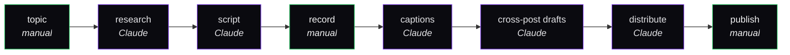

# Case Study: YouTube Production Pipeline

Internal automation that takes a video idea from research → script → captions → cross-post drafts. Powers two channels in two languages.

> **Status:** Live, in daily use.
> **Months in:** ~3.
> **Time-to-first-version:** 1 week.

## Why this isn't a SaaS

This is **infrastructure, not product**. It exists to make the content side of the operation cheap enough that one person can run it alongside building software. There's no plan to commercialize it.

But it's worth documenting as a case study because:

1. It's the most-used "product" in the stack (touched daily, not weekly)
2. It demonstrates the **internal-tools-as-leverage** pattern that solo founders underuse
3. The architecture transfers to anyone in the same situation

## Pipeline shape

Three of seven steps are manual. The rest is Claude-assisted. The split is deliberate — see [`workflows/content-pipeline.md`](../workflows/content-pipeline.md).

## Stack and why

| Choice | Why |
|--------|-----|
| **Python + uv** | Fast iteration, ecosystem for media tools |
| **yt-dlp** | Pulling competitor video subtitles for research |
| **OpenAI Whisper (local)** | Captioning own footage offline + cleaning competitor subs |
| **Claude API + ECC's `content-engine`** | Script + cross-post drafts |
| **Markdown files in `~/Brain/Content/`** | Single source of truth, syncs via Obsidian Git |
| **Custom CLI scripts** | Glue between the steps |

Rejected:

- **All-in-one creator tool (Descript, etc.)** — useful for editing, not flexible enough to be the orchestrator
- **OpenAI for everything** — Claude's longer context is what makes whole-video script drafting work
- **Cloud transcription services** — local Whisper is good enough and free

## What got built

- CLI for pulling N competitor videos in a niche, transcribing them, summarizing trends
- Brief-generator that produces a one-page topic brief in `~/Brain/Content/`
- Script generator with hook + sections + B-roll markers
- Caption cleaner — runs local Whisper, then Claude humanizer to remove obvious AI artifacts
- Cross-post generator (X thread + Instagram caption + LinkedIn post) from a single source script
- All output stored in Markdown, synced via the Obsidian vault

## What's open

- Auto-thumbnail generation (currently manual in Figma)
- Auto-publish to draft on YouTube via the Data API (currently manual upload)
- Multi-language: pipelines exist for two languages but voice + tone need separate prompts per language to feel native

## What I'd do differently in v2

- **Don't optimize the pipeline before optimizing the publish cadence.** I spent week 1 making the pipeline fast. Should have spent it making sure I'd actually publish 1 video/week consistently. Pipeline is useless if cadence isn't there.
- **Treat the brief as the artifact.** The 1-page brief is the most-reused output — it powers script + thumbnail + description + cross-post + email. I should have invested more in brief quality and less in script quality. The script comes from the brief.
- **Skip the script generator entirely for short-form.** Short-form needs voice, voice means I have to write it. Auto-generated short-form scripts are detectable. The pipeline is for long-form research and for the cross-post outputs; short-form scripts I now write by hand from the brief.

## Estimated time + cost

- **Build time:** ~1 week of focused work, ~1 hr/week of maintenance since.
- **Cash cost:** $0 — everything runs locally + Anthropic API for the generation steps.
- **Per-video inference cost:** small (~$0.50–1 for a long-form video brief + script).

## What I'm watching

Cadence, not pipeline performance. The metric is "did I publish this week" — not "how fast can I generate a script."

## Lessons that transferred elsewhere

- **Internal tools deserve the same care as customer products.** I touch this pipeline daily. Treating it as a real codebase (with tests on the parsers, error handling on the API calls) saved several debugging hours.
- **Markdown + Git for output storage = free version control.** Every script has full history. Easy to roll back a bad rewrite.
- **Local-first beats cloud where possible.** Whisper local instead of an API saves money + works offline + protects unreleased footage from being on a third-party server.
