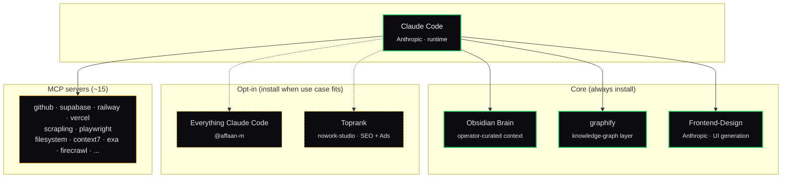

# The Stack

Four core components, two opt-in extensions, one curated layout, full attribution.

## Components

### Core (always install)

| Component | Layer | Original author | Notes |
|-----------|-------|-----------------|-------|
| [Claude Code](https://www.anthropic.com/claude-code) | Orchestration | Anthropic | The runtime |
| [Obsidian as Second Brain](obsidian-brain.md) | Operator-curated context | local | `~/Brain` vault as shared context surface |
| [graphify](graphify.md) | Knowledge graph | local | Folder of files → navigable knowledge graph with community detection |
| [Frontend-Design](frontend-design.md) | UI generation | Anthropic | Distinctive, opinionated UI |

### Opt-in (install when the use case fits)

| Component | Layer | Original author | When to add |
|-----------|-------|-----------------|-------------|
| [Everything Claude Code](ecc.md) | Skills + Agents | [@affaan-m](https://github.com/affaan-m) | When you want a broad skill + agent catalog (182 skills, 48 agents) |
| [Toprank](toprank.md) | SEO + Paid Ads | nowork-studio | When you do SEO audits or run Google/Meta Ads |

Adjacent reference material:

| Doc | Notes |
|-----|-------|
| [ECC Skill Index](ecc-skill-index.md) | Curated lookup of the ~30 ECC skills the operator actually uses (only relevant if ECC is installed) |
| [MCP Servers](mcp-servers.md) | The MCP servers I actually run |

## Read order

If you are setting this up for the first time, read in this order:

1. **Claude Code** — the runtime is the assumed starting point. Install Claude Code first if you don't already have it.
2. **obsidian-brain.md** — the operator-curated context surface. Install Obsidian + create a `~/Brain` vault.
3. **graphify.md** — the knowledge-graph memory tier. Install once Obsidian has more than a single project's worth of content.
4. **frontend-design.md** — install if you ship UIs.
5. **ecc.md** *(opt-in)* — add if you want a broad skill + agent catalog. The cookbook recipes assume some ECC skills are available; without them you'll write more by hand.
6. **toprank.md** *(opt-in)* — add only if you do SEO or paid ads.

Most readers will install Core first, ship something with it, and add ECC + Toprank only when a real use case for either appears.

## Why this shape

The Solo Stack and Everything Claude Code are designed to coexist. Core is what carries the day-to-day weight: a runtime, a curated note vault, a knowledge graph layered over it, and a UI generator. Opt-in extensions slot in cleanly when their domain (broad skill catalog, SEO + paid ads) actually shows up in real work.

- **Obsidian + graphify** = two-tier context (operator-curated notes + knowledge-graph layer over folders) instead of one
- **MCP set chosen for solo operator load** — the minimum that pays for itself, not the maximum
- **ECC and Toprank stay opt-in** so the stack remains honest about what's load-bearing vs. what's optional

Adding more components is easy; the discipline is removing components that don't pay off.

## What is *not* in the stack

Deliberately:

- **Cursor** — I use it for some tasks, but the stack is built around Claude Code as the orchestrator. Cursor is a tool, not a layer.
- **General-purpose computer-use** — installed but rarely enabled. Burns context.
- **Anything with auto-commit + auto-push enabled** — too risky for solo ops where there's no second pair of eyes.
