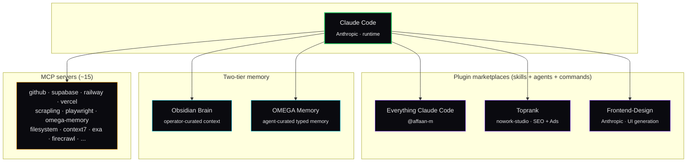

# The Stack

Six components, one curated layout, full attribution.

| Component | Layer | Original author | Notes |
|-----------|-------|-----------------|-------|
| [Everything Claude Code](ecc.md) | Skills + Agents | [@affaan-m](https://github.com/affaan-m) | 182 skills, 48 agents — the backbone |
| [Toprank](toprank.md) | SEO + Paid Ads | nowork-studio | Google Ads, Meta Ads, GEO, GSC analysis |
| [Frontend-Design](frontend-design.md) | UI generation | Anthropic | Distinctive, opinionated UI, anti-template |
| [Obsidian as Second Brain](obsidian-brain.md) | Operator-curated context | local | `~/Brain` vault as shared context surface |
| [OMEGA Memory](omega-memory.md) | Agent-curated memory | local | Persistent typed memory across sessions |
| [MCP Servers](mcp-servers.md) | Integrations | various | The MCP servers I actually run |

## Read order

If you are setting this up for the first time, read in this order:

1. **mcp-servers.md** — the integrations are the foundation. Without GitHub + Supabase + scrapling + omega-memory, the workflows below don't have anything to call.
2. **ecc.md** — the skill + agent layer that sits on top of MCP.
3. **toprank.md** — only if you do SEO or paid ads (most operators do).
4. **frontend-design.md** — only if you ship UIs.
5. **obsidian-brain.md** — once you have more than one project in flight.
6. **omega-memory.md** — once Obsidian alone stops being enough.

## Why these six

Everyone's stack has skills and agents. The combination that makes this one different:

- **ECC + Toprank** = code work + business work share one runtime
- **Obsidian + OMEGA** = two-tier memory (operator-curated + agent-curated) instead of one
- **MCP set chosen for solo operator load** — not the maximum, the minimum that earns its keep

Adding more components is easy. The discipline is removing components that don't earn their keep.

## What is *not* in the stack

Deliberately:

- **Cursor** — I use it for some tasks, but the stack is built around Claude Code as the orchestrator. Cursor is a tool, not a layer.
- **General-purpose computer-use** — installed but rarely enabled. Burns context.
- **Anything with auto-commit + auto-push enabled** — too risky for solo ops where there's no second pair of eyes.
