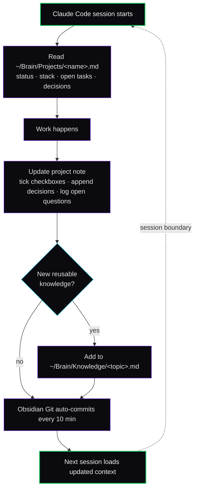

# Obsidian as Context

The full loop — how Obsidian becomes the shared memory that Claude reads automatically and writes back to.

## The loop in one diagram



## The integration rule

Lives at `~/.claude/rules/obsidian-integration.md` (shipped in this stack at `configs/rules/obsidian-integration.md`).

Tells Claude:

1. **On session start:** check `~/Brain/Projects/` for a note matching the current directory name. If found, read it.
2. **After significant work:** update the relevant note — checkboxes, decisions, findings.
3. **After research:** save key findings to `~/Brain/Knowledge/<topic>.md` so they survive across sessions and projects.
4. **Content work:** drafts go in `~/Brain/Content/`, tracked in `~/Brain/Projects/YT Scenarios.md` if relevant.
5. **Language convention:** vault language is Russian (or whatever yours is). Code is English; vault prose is the operator's first language.

The rule is short, under 80 lines. That's the contract; everything else is convention.

## Project note shape

```markdown
---
tags: [project, status/active]
status: active
repo: https://github.com/you/...
url: https://...
stack: [TypeScript, Next.js, Supabase]
created: 2026-01-15
---

# <Project name>

## Hypothesis
What I believe about this market.

## Current state
- 3-line summary of where this is

## Open tasks
- [ ] thing
- [ ] thing

## Decisions
- 2026-01-20: chose Postgres over SQLite because of full-text search needs
- 2026-02-03: switched OAuth to Clerk after Auth.js v5 broke twice in a row

## Open questions
- waiting on customer for X
- not sure about Y, will revisit Friday

## Links
- [[Knowledge/X]]
- [[Knowledge/Y]]
```

## The Knowledge tier

Decisions live in project notes. **Reusable solutions live in `~/Brain/Knowledge/`**.

Examples of what goes there:

- "How I set up Cloudflare Argo Tunnels for local dev preview"
- "Stripe Connect onboarding flow for P2P marketplaces"
- "Gotchas with Vercel preview deployments + Supabase pooled connections"

These survive past any single project. When I start project N+1 and need to do "the Stripe Connect thing again," Claude finds the Knowledge note and saves an hour.

## The Daily tier

`~/Brain/Daily/YYYY-MM-DD.md` — open every morning. Holds:

- 3 things I want to ship today
- Notes captured throughout the day
- 1-line evening review

Daily notes are not where decisions live. Decisions migrate from Daily to either project notes or Knowledge during a Sunday review pass.

## Sync

Obsidian Git plugin → private GitHub repo. Auto-commit every 10 min. Auto-pull every 10 min. Conflicts are rare if I only edit on one device at a time; when they happen, resolve manually in Obsidian.

GitHub repo is private. The vault is personal infrastructure, not a content product.

## Scope

Obsidian is curated by the operator. Claude reads from it (lots) and writes to it (sparingly, with structure), but the judgment about what belongs in the vault stays with the human. The day Claude starts deciding what's important enough to remember in your second brain, you stop being the operator and start being the audience.

## Common failure modes

- **Vault becomes a journal, not a knowledge base.** Migrate Daily entries to Knowledge weekly or your second brain becomes a diary.
- **Project notes go stale.** Every session that touches a project should leave the note in a state someone (including future you) could pick up cold.
- **Open questions get hidden.** Use a single `## Open questions` heading per project — never bury them in commit messages or Slack.
- **Knowledge notes become essays.** Keep them <500 words. Link out, don't expand inline.
