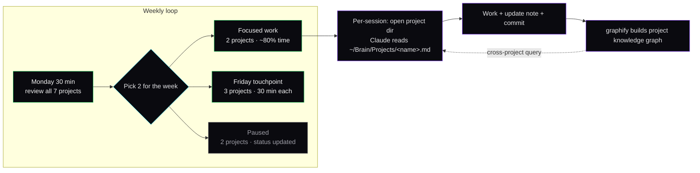

# Parallel Projects

How seven projects stay in flight without context collapse.

The default failure mode of solo multi-project work is **context fragmentation**: switching between products costs an hour each time, you forget where you were, and the smallest project starves while the loudest one eats your week.

Three mechanical habits make this work for me.

## Habit 1: One Obsidian note per project, single source of truth

Every project has exactly one note in `~/Brain/Projects/<name>.md`. The note holds:

- Status (active / paused / done / archived)
- Stack
- Repo URL
- Live URL if any
- Open tasks (checklist)
- Decisions log (append-only)
- Open questions (where I'm stuck or waiting)

If the note doesn't exist, the project doesn't exist. If a thing isn't in the note, I don't owe it my attention this week.

The `obsidian-integration` rule (in `configs/rules/`) tells Claude to read this note at the start of any session in that project's directory. So switching projects is "open the directory" — Claude loads the right context automatically.

## Habit 2: A weekly "where are we" loop

Every Monday, 30 minutes:

1. Open `~/Brain/Home.md` — the dashboard view (Dataview query of all active projects)
2. For each active project, glance at the open tasks + open questions
3. Decide which 2 projects get focus this week
4. Mark the others "paused — touching on Friday only"

The filter is what stops all 7 projects from competing every day. Two get focused work; the other five slot into a 30-minute Friday touchpoint.

The decision criterion: which project's next milestone moves the needle most for revenue or evidence — not "which is most fun" or "which is loudest in my head."

## Habit 3: Per-project Claude Code worktrees

Each project lives in its own directory with its own `.claude/` if it needs project-level overrides. Sessions don't cross projects. When I'm in a specific project's directory, Claude is loaded with that project's context only.

For tasks that span projects (e.g., "deploy all 3 sites to staging"), I run them from a separate `~/ops/` directory with its own scoped context, and explicitly point Claude at the relevant repos.

## The third-rail rules

These I learned the hard way:

- **No project gets more than 4 days of silent work without a public commit.** Silent work compounds risk that the work was wrong. If 4 days have passed and no PR, force a small visible step — even an interim README update.
- **No two projects deploy in the same session.** Switching the deploy target mid-session is how prod for project A gets the env vars for project B. Worktrees + separate sessions enforce this.
- **One project's incident pauses the others.** When something is on fire (live site down, customer escalation), all other projects are explicitly paused for the day in their Obsidian notes. Otherwise the incident bleeds into half-done work elsewhere.

## What about context windows?

Each project session uses its own context window. Cross-session bridging happens through graphify: each project builds a knowledge graph from its notes and code, and `/graphify query "<concept>"` traverses that graph to surface decisions made in other projects' sessions.

The graph layer is what stops context-window-isolated sessions from feeling siloed — instead of typed memory lookups, you get BFS/DFS traversal across the cross-project knowledge graph and community detection that clusters related decisions even when they live in different project notes.

## Scope

This isn't a "fan out to N parallel agents and let them all work" pattern. That works for narrow research tasks but not for product work, where products need decisions, decisions need state, and state needs to be authoritative in one place. The stack is built around one operator with sequential focus across projects, not parallel agents with no coordinator.

## Numbers from my own loop

In a typical week:

- 2 projects get 80% of focused time (10–15 hr each)
- 3 projects get 30-min Friday touchpoints
- 2 projects sit paused with status updated, no work
- 1 hour goes to Monday planning + Friday review

The discipline is being honest about which projects are *not* getting attention this week, so you stop owing them mental load.
